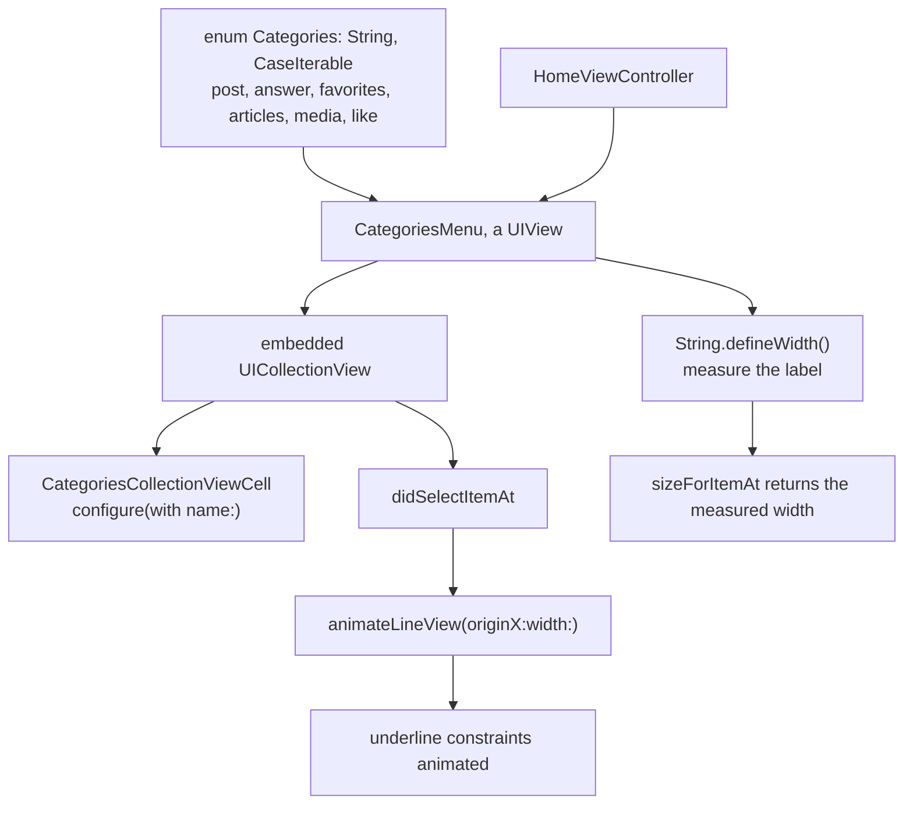

# Categories Menu

*A sliding tab strip where the underline animates to the selected item.*

    

## Overview

The horizontal category bar used on social profiles. Items are sized to their text rather than split evenly, and the indicator moves and resizes to match whichever item is selected.

## How it works



## Implementation notes

- **Widths measured from text.** `defineWidth` measures the string with its font, so long and short titles both look right instead of being forced into equal columns.
- **The indicator is a constrained view.** Moving it means animating constraint constants, which keeps it correct under rotation, unlike animating a frame.
- **Categories from an enum.** `CaseIterable` provides the ordering and the raw values provide the titles, so the data and the display cannot fall out of step.
- **The strip is self contained.** `CategoriesMenu` is a `UIView` that owns its collection view, so the host controller adds one subview.

## Project structure

```
CategoriesMenu/
├── Categories.swift                 the category enum
├── CategoriesMenu.swift             the strip view and its animation
├── CategoriesCollectionViewCell.swift
├── HomeViewController.swift
└── String+Extensions.swift          text measurement
```

## Requirements

Xcode 15 or later, iOS 17.4 or later. No external dependencies.
